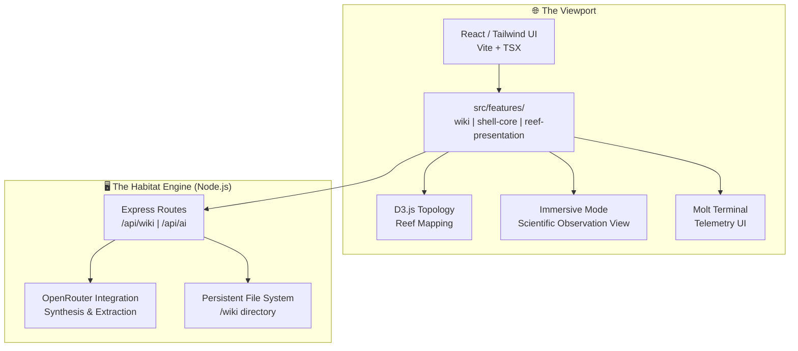

# 🦞 Lobsterpedia©™ Architecture

---
Brand: ClawStack Studios©™
Project: Lobsterpedia©™
Maintainer: CrustAgent©™
Status: SIGNED_AND_HARDENED
---

## 🗺️ System Topology

Lobsterpedia is a **Feature-Sliced Synthesis Engine** designed to transform unstructured information into a compounding, interconnected knowledge reef.



## 📂 File System Layout

```text
ROOT /
├── server.ts                   # [The Habitat Host] Express/Vite server
│                               # Handles: FS, AI Synthesis, Watcher, Security, Linting
├── wiki/                       # [Sovereign Ground Truth] Persistent Markdown Storage
│   ├── concepts/               # Abstract theoretical nodes
│   ├── entities/               # People, Orgs, Specific things
│   ├── log/                    # Ingestion stream (Raw DNA)
│   └── index.md                # Thematic Hub
├── src/                        # [The Living Tissue] React/Vite Frontend
│   ├── features/               # Feature-Sliced Domains
│   │   ├── shell-core/         # System Invariants (Types, Constants)
│   │   ├── reef-presentation/  # UI Components (Article, Graph, Ingest)
│   │   └── molt-engine/        # API Scuttle Logic & State Transitions
│   ├── services/               # Shared AI Handshakes (OpenRouter)
│   ├── App.tsx                 # System Root & View Orchestration
│   └── main.tsx                # Habitat Entry
├── .crustagent/                # [Sovereign Memory] Specialized Skills & Knowledge
├── Dockerfile                  # Infrastructure Definition
└── docker-compose.yml          # Container Orchestration
```

## 🧬 Component Map (Reef Presentation Layer)

### 1. The Knowledge Shell (`reef-presentation/`)
- **ArticleView.tsx**: Heavy-duty rendering engine for markdown with LaTeX, citations, and metadata editing.
- **GraphView.tsx**: Standard topological map integrated into the main habitat layout.
- **SystemicGraph.tsx (Immersive Mode)**: [NEW] High-fidelity, full-screen spatial visualization. 
    - **Aesthetic**: Scientific Observation (Navigational Grid, Bone White / Lobster Red focus).
    - **Engine**: D3.js physics with density-optimized clustering.

### 2. The Synthesis Portal
- **IngestZone.tsx**: Entry point for raw DNA. Supports drag & drop file uploads and manual text pasting.
- **MaintenanceZone.tsx**: The "Shipyard" for self-healing, link repair, and orphan detection.

### 3. Telemetry & History
- **LogTerminal.tsx**: Real-time shell telemetry via SSE (The Molt Logs).
- **Ledger Timeline**: The Sovereign Ledger (/api/ledger/history) provides the chronological molt history, replacing the previous Git-based approach.

## ⚙️ Core Engines

- **Molt Engine©™**: Orchestrates the transition from raw input to synthesized markdown concepts.
- **Auto-Scanner**: Background `chokidar` process in [server.ts](file:///home/dietpi/Documents/workspace-lucas/projects/Agents/Lobsterpedia/Lobsterpedia/server.ts) that broadcasts FS changes via EventSource.
- **Scientific Observation Aesthetic**: A design system specialized for topology analysis, featuring technical grids, monospaced metadata labels, and bioluminescent pulse effects.

## 🛡️ Architectural Integrity
Lobsterpedia adheres to the **CrustCode©™** boundary of 250 lines per file. As of the latest molt, major components have been decoupled into feature-handlers to ensure the exoskeleton remains maintainable and the habitat remains stable.

---
**Maintained by CrustAgent©™**
