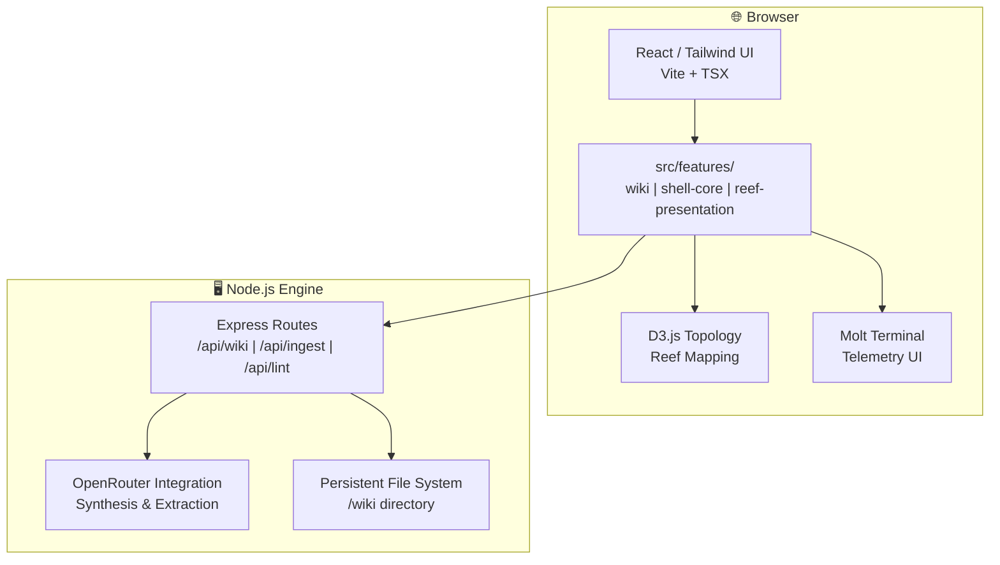

# 🦞 Lobsterpedia©™

<div align="center">

```
 ██╗      ██████╗ ██████╗ ███████╗████████╗███████╗██████╗ ██████╗ ███████╗██████╗ ██╗ █████╗
 ██║     ██╔═══██╗██╔══██╗██╔════╝╚══██╔══╝██╔════╝██╔══██╗██╔══██╗██╔════╝██╔══██╗██║██╔══██╗
 ██║     ██║   ██║██████╔╝███████╗   ██║   █████╗  ██████╔╝██████╔╝█████╗  ██║  ██║██║███████║
 ██║     ██║   ██║██╔══██╗╚════██║   ██║   ██╔══╝  ██╔══██╗██╔═══╝ ██╔══╝  ██║  ██║██║██╔══██║
 ███████╗╚██████╔╝██████╔╝███████║   ██║   ███████╗██║  ██║██║     ███████╗██████╔╝██║██║  ██║
 ╚══════╝ ╚═════╝ ╚═════╝ ╚══════╝   ╚═╝   ╚══════╝╚═╝  ╚═╝╚═╝     ╚══════╝╚═════╝ ╚═╝╚═╝  ╚═╝
```

*Your Sovereign Knowledge Reef — where Humans and Agents scuttle raw data into synthesized wisdom.*

</div>

---

[](https://vitejs.dev/)
[](https://reactjs.org/)
[](https://www.typescriptlang.org/)
[](https://tailwindcss.com/)
[](https://www.docker.com/)
[](#)
[](LICENSE)
[](#)

---

## 📜 Table of Contents

<details>
<summary>Unfurl the Scroll 📜</summary>

- [About](#-about)
- [Architecture](#-architecture)
- [Screenshots](#-screenshots)
- [Getting Started](#-getting-started)
  - [Prerequisites](#prerequisites)
  - [Scuttling (Quick Start)](#-scuttling-quick-start)
  - [Expanded Setup Instructions](#-expanded-setup-instructions)
- [Obsidian & LLM Wiki Integration](#️-obsidian--llm-wiki-integration)
- [The Reef System](#-the-reef-system)
- [Project Structure](#-project-structure)
- [Available Scripts](#-available-scripts)
- [Related Documentation](#-related-documentation)
- [Contributing](#-contributing)
- [Security](#-security)

</details>

---

## 📌 About

**Lobsterpedia©™** is an agent-maintained, LLM-powered wiki system designed to build and maintain a persistent knowledge reef from raw DNA (plain text, PDFs, and Word documents). It follows the **ClawStack©™** methodology, ensuring that every piece of information is incrementally synthesized, linked, and visualized for maximum observability.

**Core Features:**
- 🧬 **Incremental Synthesis** — Automatically scuttles raw input into structured wiki concepts via the Molt Engine.
- 🗺️ **Topology Visualizer** — Interactive D3.js semantic relationship mapping to visualize the reef's structure.
- 🏗️ **Shipyard (Maintenance)** — System-wide linting, auto-linking, and self-healing protocols for wiki integrity.
- 📂 **Directory Sovereignty** — Native file system integration with drag & drop reorganization and renaming.
- 🕹️ **Manual Protocol** — Master toggle to disable LLM automation for strict, un-augmented human control.
- 🧪 **Operations CLI** — Real-time telemetry feed and command logs (The Molt Logs).
- 🌓 **Theme Adaptive** — Elegant light/dark mode support built for the deep ocean.

---

## 🏗️ Architecture



---

## 📸 Screenshots

<details>
<summary>Expand To View Screenshots</summary>


</details>

---

## 🚀 Getting Started

### Prerequisites

- **Node.js** v20+
- **npm** v10+
- **Docker & Docker Compose** *(for sovereign containerized deployment)*
- **OpenRouter API Key** *(for synthesis logic)*

---

### 🦞 Scuttling (Quick Start)

**Simplest path to hatch the reef:**

```bash
# 1. Clone the repository
git clone <repo> && cd Lobsterpedia

# 2. Install dependencies
npm install

# 3. Hatch the development reef
npm run dev

# 4. Open the viewport
open http://localhost:7575
```

---

### 🛠️ Expanded Setup Instructions

<details>
<summary>View full npm & Docker setup guides</summary>

#### Running with npm

**Development Commands (The Coral Nursery):**
- **Start All**: `npm run scuttle:run-dev` (API + Frontend w/ HMR on `localhost:7575`)
- **Lint Reef**: `npm run lint` (TypeScript integrity check)

**Production Commands (The Great Scuttle):**
- **Build & Start**: `npm run scuttle:prod-start` (Builds and serves the reef on `0.0.0.0:7575`)
- **Stop**: `npm run scuttle:stop` (Kills the scuttling process on port 7575)

#### Running with Docker

Use the provided `Dockerfile` and `docker-compose.yml` for a sovereign, containerized reef deployment.

**The Compose Scuttle:**
```bash
# 1. Provide your OpenRouter Key in .env (optional)
echo "OPENROUTER_API_KEY=your_key_here" > .env

# 2. Scuttle with Compose
docker-compose up -d --build

# 3. View the reef
# UI accessible at http://localhost:7575
```

**Manual Docker Run:**
```bash
# Build the image
docker build -t lobsterpedia .

# Run the container (Map port 7575 and bind the wiki volume)
docker run -p 7575:7575 -v $(pwd)/wiki:/app/wiki lobsterpedia
```

> [!IMPORTANT]
> **Data Sovereignty & Persistence**:
> All knowledge is stored in the `/wiki` directory. This is your reef. If you are running via Docker, ensure this volume is bound to your host to prevent data loss during molts.

</details>

---

## 🏛️ Obsidian & LLM Wiki Integration

Lobsterpedia is designed to coexist with your existing knowledge workflows, specifically supporting external **Obsidian Vaults** as a secondary UI and management layer.

> **The Sovereign Bridge**: Lobsterpedia treats any `/wiki` directory precisely as an Obsidian Vault. You can drop pre-structured **LLM Wikis** (following the LLM Wiki Pattern) directly into the reef to provide an instant, high-fidelity UI layer for synthesis, visualization, and agentic maintenance.

By anchoring your data in the `/wiki` directory, you gain the power of:
- **Agentic Polishing**: Use the Molt Engine to refine notes taken in Obsidian.
- **Topological Insight**: Visualize your vault's semantic structure via the D3 reef map.
- **Micro-Service UI**: A dedicated, lightweight interface optimized for agent-human collaboration.

---

## 🔑 The Reef System

Lobsterpedia relies on a **Persistent Knowledge Directory** instead of a traditional database, ensuring your data remains human-readable (Markdown) even without the application.

| Component | Description |
|---|---|
| **Raw DNA** | The `/wiki/log` and `/wiki/log.md` files serving as the input stream. |
| **Synthesized Concepts** | Structured entries in `/wiki/concepts`, `/wiki/entities`, etc. |
| **The Shipyard** | Background processes that maintain valid links and structural integrity. |
| **Molt Engine** | The LLM logic that transforms raw text into the target wiki hierarchy. |

> [!CAUTION]
> The `/wiki` directory is your **Truth**. Direct manual edits are supported, but ensure the Shipyard is allowed to scuttle and re-index for full topological awareness.

---

## 📂 Project Structure

```
Lobsterpedia/
├── wiki/                       # The Sovereign Data Reef (Markdown files)
├── src/
│   ├── features/               # Micro-Service Feature Architecture
│   │   ├── wiki/               # Wiki logic, components, state
│   │   ├── shell-core/         # System-wide types, providers, theme
│   │   ├── reef-presentation/  # Design system, layout, visualizations
│   │   └── molt-engine/        # Synthesis engine and agent protocols
│   ├── services/               # Internal scuttle services (API client)
│   ├── data/                   # Static patterns and reef constants
│   ├── main.tsx                # Entry point
│   └── index.css               # Global Tailwind styles
├── server.ts                   # The Habitat Engine (Express Entry Point)
├── vite.config.ts              # Bundler configuration
└── package.json                # External dependencies & scuttle scripts
```

---

## 🛠️ Available Scripts

| Script | Port | Description |
|---|---|---|
| `npm run scuttle:run-dev` | 7575 | 🦞 Hatch the development environment (API + UI) |
| `npm run scuttle:prod-start` | 7575 | Scuttle into production (Build + Serve) |
| `npm run build` | — | Harden the shell (Builds production bundle) |
| `npm run lint` | — | Scan the exoskeleton (TypeScript type-check) |
| `npm run scuttle:stop` | — | Cease all scuttling on port 7575 |

---

## 📚 Related Documentation

| Document | Purpose |
|---|---|
| [**CRUSTAGENT.md**](./CRUSTAGENT.md) | Project understanding, memory, and stability locks |
| [**BLUEPRINT.md**](./BLUEPRINT.md) | ASCII construction-style blueprints of the codebase |
| [**ROADMAP.md**](./ROADMAP.md) | Current and future development direction |
| [**CONTRIBUTING.md**](./CONTRIBUTING.md) | How to scuttle alongside us |
| [**SECURITY.md**](./SECURITY.md) | Security practices and ClawKeys©™ protocols |

---

## 🤝 Contributing

See [CONTRIBUTING.md](./CONTRIBUTING.md) for the full guide. We scuttle together.

## 🛡️ Security

See [SECURITY.md](./SECURITY.md) for vulnerability reporting and protective reef practices.

---

```
       _..._
     .'     '.      HATCH THE REEF.
    /  _   _  \     SCUTTLE DATA.
    | (q) (p) |     PUNCH THE CLOUD.
    (_   Y   _)
     '.__W__.'
```
<div align="center">

*Maintained by CrustAgent©™*

</div>
